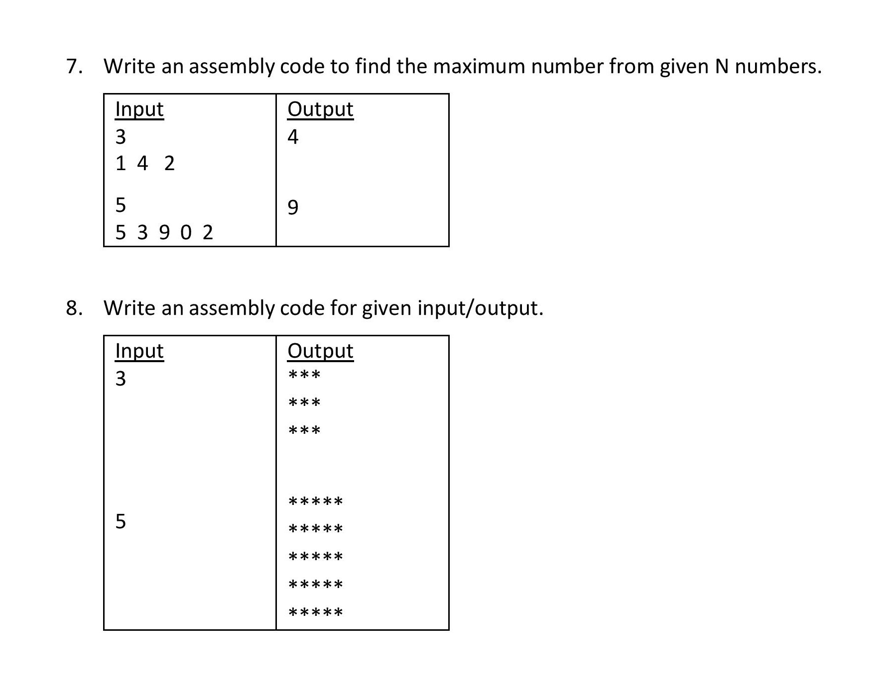
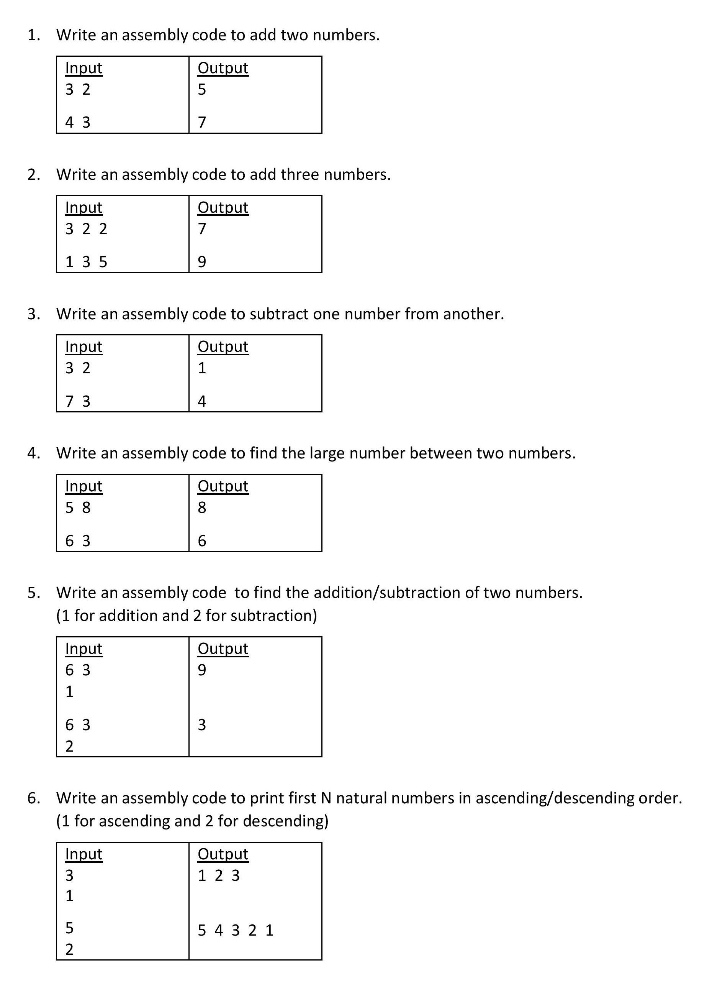

<h1 align="center" >Microprocessor & Assembly Language </h1>

## **What Is Assembly Language**:
The assembly programming language is a low-level language which is developed by using mnemonics. The microcontroller or microprocessor can understand only the binary language like 0's or 1's therefore the assembler convert the assembly language to binary language and store it the memory to perform the tasks.
[For More](https://jbwyatt.com/253/emu/asm_tutorial_01.html)

## **Where To Learn**:
[I Learned From This Youtube Channel](https://www.youtube.com/watch?v=OdlQByyiTR4&list=PLKiZXxQe7OiD8UrEPx5GDhzOwEaNujSeL)
Also More Resource Worth Mentioning
[Link 1](https://www.tutorialspoint.com/assembly_programming/index.htm)
[Link 2](https://faculty.kfupm.edu.sa/COE/shazli/coe205/Help/asm_tutorial_01.html)
[Link 3](https://riptutorial.com/assembly)

## **Where To Get Emu8086 Full Version**:
Check The Zip File In Repo

## **What's This Repo For**:
This Repo Contains The Code of Assebly Language of 8086 Processor.It Contain Some Exercises & Assignment

 Exercise & Assignment Photo
    
    

